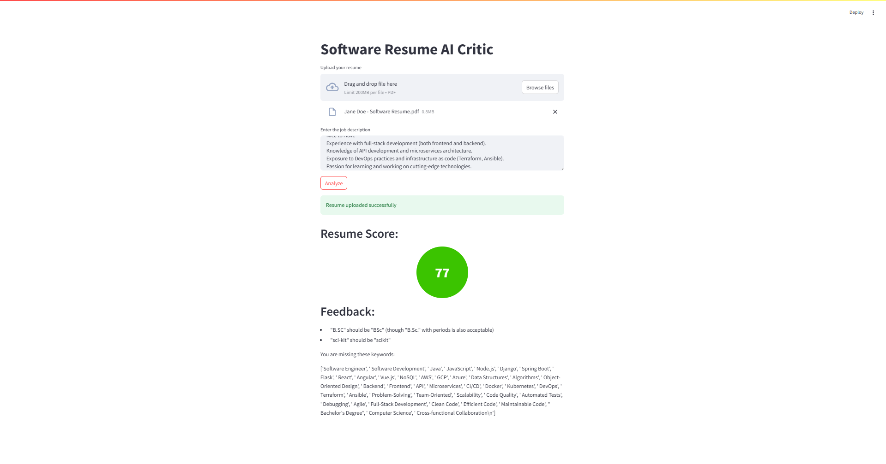

# Resume-Critic-AI

## Description ##

Resume Critic is a Streamlit-based web application that helps job seekers optimize their resumes by identifying errors and suggesting improvements. The tool leverages Gemini 2.0 Flash (Experimental) to analyze resume content, ensuring alignment with job descriptions and industry expectations.

Features:

- Resume Upload: Users can upload their resume in PDF format.
- Text Extraction: Automatically extracts text from the resume for analysis.
- Assessment: Scores the resume based on various factors like spelling, structure, and keyword relevance on a scale of 0-100
- Keyword Matching: Identifies missing industry-relevant keywords based on the job description provided.
- Grammar & Spelling Check: Detects errors and suggests corrections.
- Formatting Analysis: Checks for proper capitalization, bullet points, verb usage, and more.
- Feedback & Recommendations: Provides actionable suggestions for improving the resume.

Technologies:

- Python (Backend Processing)
- Streamlit (Web UI)
- PyPDF2 (PDF Text Extraction)
- Gemini API (for language processing)





## Notes ##

1. Login to Google AI Studio and create a free API key. Copy this key into the ```python .env``` file and where it says "GEMINI_API_KEY". **Do not** store your key pulicly or share it. 
   - https://aistudio.google.com/apikey
2. To launch the streamlit app, run ```python streamlit run frontend.py``` in your bash terminal
3. Ensure ```python backend.py``` is in the same directory as ```python frontend.py```
4. It is good practice to install the libraries in a virtual environment (.venv)


## Attributions & Remarks ##

The entirity of this project rested on the kind help of the following websites. As always, ChatGPT proved an immense help and guidance where much time and effort was saved. Much of the "frontend.py" code was written by ChatGPT

- https://chatgpt.com/
- https://aistudio.google.com/apikey

Please feel free to give any feedback on how to optimize this code. Thank you for your time.
